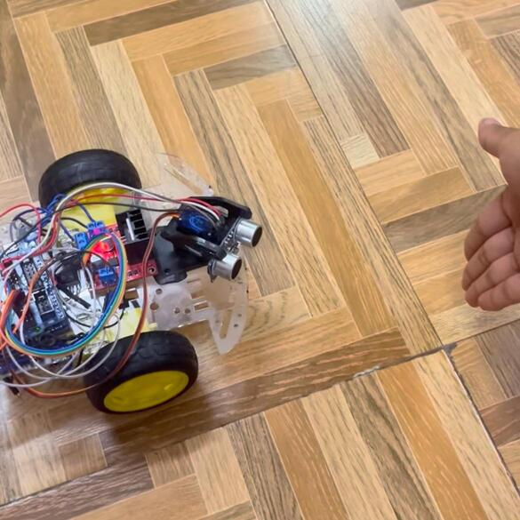
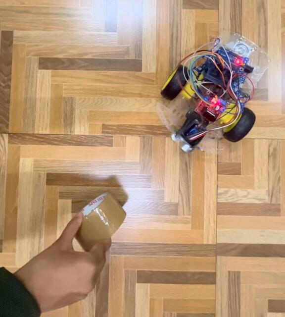

# 🤖 Object Follower Robot


An Arduino-based robot that autonomously follows a moving object using an HC-SR04 ultrasonic sensor mounted on a servo. The servo scans left, center, and right to track the object's position and steer accordingly — backing off if it gets too close.

---

## 📸 Demo

  
  
 


## ⚙️ How It Works

The servo sweeps the ultrasonic sensor across three angles to detect an object's position:

| Servo Angle | Direction Scanned |
|-------------|-------------------|
| 160° | Left |
| 115° | Center |
| 70° | Right |

Based on detections (within 20 cm), the robot decides to move forward, turn, or back up:

| Situation | Action |
|-----------|--------|
| No object detected anywhere | Stop |
| Object in center, distance > 4 cm | Move forward |
| Object in center, distance < 4 cm | Back up (too close) |
| Object on left only | Turn left |
| Object on right only | Turn right |
| Object on both sides | Turn toward the closer one |

---

## 🧰 Components

| Component | Quantity |
|-----------|----------|
| Arduino Uno | 1 |
| HC-SR04 Ultrasonic Sensor | 1 |
| Servo Motor (SG90 or similar) | 1 |
| L298N Motor Driver | 1 |
| DC Motors | 2 |
| Chassis + Wheels | 1 set |
| 9V / Li-ion Battery | 1 |
| Jumper Wires | As needed |

---

## 📌 Pin Configuration

| Pin | Function |
|-----|----------|
| 10 | Ultrasonic TRIG |
| 2 | Ultrasonic ECHO |
| 5 | Servo Motor |
| 3 | ENA (Right Motor Enable) |
| 8 | Right Motor IN1 |
| 7 | Right Motor IN2 |
| 9 | ENB (Left Motor Enable) |
| 6 | Left Motor IN1 |
| 4 | Left Motor IN2 |


## 🚀 Getting Started

### Prerequisites
- [Arduino IDE](https://www.arduino.cc/en/software)
- `Servo.h` library (built into Arduino IDE)

### Upload the Code
1. Clone this repository:
   ```bash
   git clone https://github.com/Ashritha-Abbabathula/object_follower.git
   ```
2. Open `object_follower.ino` in the Arduino IDE
3. Select **Board**: Arduino Uno and the correct **Port**
4. Click **Upload**

---

## 🎛️ Tuning Parameters

```cpp
#define DETECT_DIST  20   // Max distance (cm) to detect and follow object
#define TOO_CLOSE     4   // Min distance (cm) before backing up
#define MOTOR_SPEED 120   // Base motor speed (0–255)
#define TURN_SPEED  140   // Turning motor speed (0–255)
```

If your motors are inverted, adjust:
```cpp
#define INVERT_RIGHT  -1
#define INVERT_LEFT    1
```

---

## 📁 File Structure

```
object_follower/
├── object_follower.ino   # Main Arduino sketch
├── assets/               # Photos, videos, circuit diagrams
│   ├── Image1.jpeg
│   └── Image2.jpeg
│   └── Video1.mp4
└── README.md
```

---

## 👩‍💻 Author

**Ashritha Abbabathula**  
[](https://github.com/Ashritha-Abbabathula)

---

## 📄 License

This project is open source and available under the [MIT License](LICENSE).
